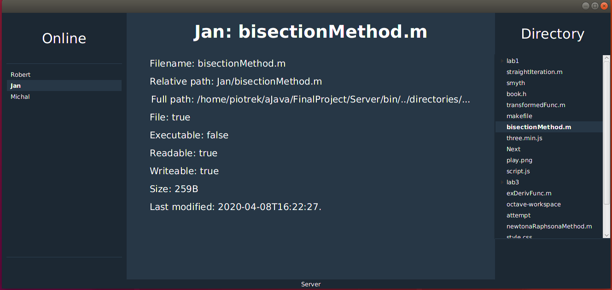
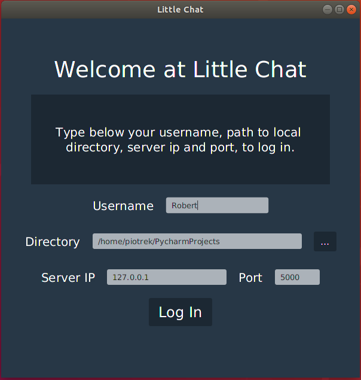
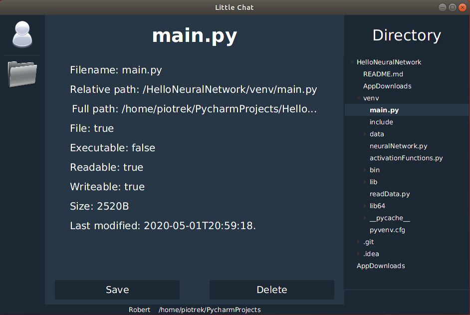
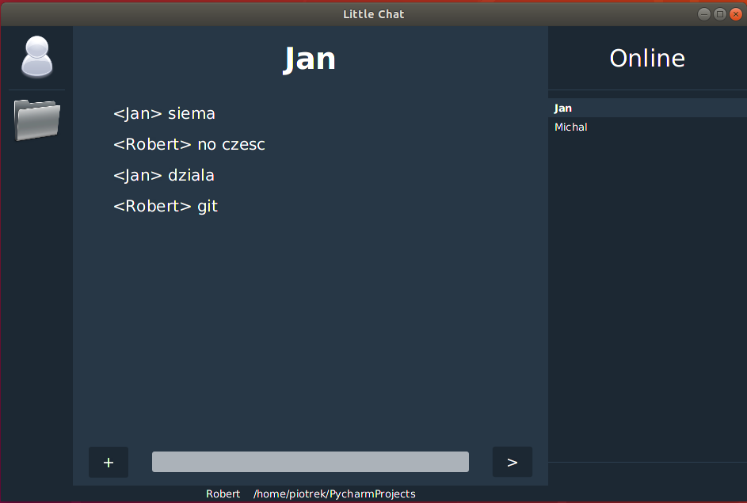

# Little Chat

Implementation of simple communicator, where you can send messages and files between users. GUI is provided by javafx package and jave.net is used for communication via sockets.

## Run server

Compile code from Server directory and run it with path to directory, which is destination for each user private directory[1]. If you won't pass it, it will take default value './directory'.

It is main view of server application, where <i>Online</i> section display names of available users and highlight name of that one, who is previewed. <i>Directory</i> section show us content of user directory, which is located at passed directory[1] during running application. Main content of this view is information about currently selected file.  
At the background server handle interaction server-client and client-client.

## Client login

After compile&run code from Client directory above window will appear. We are passing here our name, choosing directory from where files will be uploaded and where will be downloaded. We can also pass server ip and port on which server is running. Few of exception are handled and corresponding message is displayed if some error occurred.

## Client view

After successful log in, we can search files in our directory and display some information about them. There is two possible actions. We can save file in remote directory located at server by clicking <i>save</i> button. By using <i>delete</i> button we are removing file from local and remote directory.   

By clicking people icon in left-up corner we are opening messenger, where basic communication between users are provided. We can send text messages (<i>[>]</i> button) or send files (<i>[+]</i> button). <i>Online</i> section display available users. We can back to previous file view by clicking directory icon.

## It's not everything

It is not finished project, a lot o things are to do. For example we should be able to see server ip and port in server view, but I had some problems with that because of my VM. Also few features can be added, like sending few files at one select, cause right now we need to send it one by one. Some help popup should be provided. Gui of messenger is really raw and it must be improved ...and on and on.
That's all the details, but I need to find some free time to implement all of this ideas.
